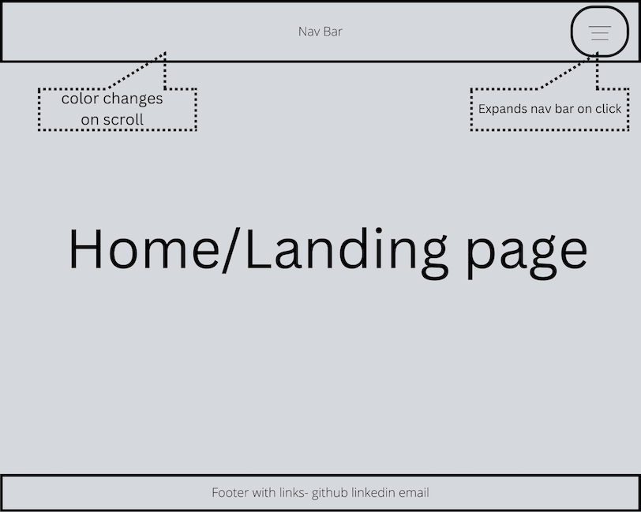

# Portfolio
General Assembly - SEI Mariposa 

Project 1: portfolio website

## Technologies used
HTML, CSS and Javascript
Visual Studio Code
## Screenshot of the app: 

 

## Installation instructions
Download html, css and html files and images folder. 
Open html file with local server (VS code Live Preview) to view the page in the browser. Navigate between the html pages using the navigation bar at the top of the website. 

## User stories 
- As a recruiter or hiring manager, I want to quickly see a demonstration of the skills and experience Mindy gained during her SEI, so that I can evaluate whether she is a good candidate for my company/team.
- As a recruiter or hiring manager, I want to get an initial impression of Mindy's style and personality, so that I can evaluate whether she is a good fit for my company/team.
- As a professional Mindy wants to network with, I want to see what Mindy has built so that I have an understanding of what her strengths are as a developer and provide helpful feedback or connections.
- As a member of Mindy's support network, I want to see what she has built so that I have an understanding of what she has learned to do as a developer and see the results.
 
## Wireframes

 

## Unsolved problems or major hurdles
 - I had challenges with the responsive design of the about me page.  The image was distorted at certain screen sizes.  I was able to solve for this by using bootstrap.  I applied an img-fluid class to the image at the set the amount of grid space that the image and text content would take up at various screens sizes. 
 - I also had changes with the resume modal, which would display briefly then close.  I reviewed all my Javascript code as well as the modal example from class but wasn't able to find the issue.  Eventually, I figured out that there was an issue with how I set up my anchor tag in the HTML file.  I didn't include anything in the href, so the page was refreshing when I clicked the link the page was refreshing. I added a # to the anchor tag which resolved the issue. 